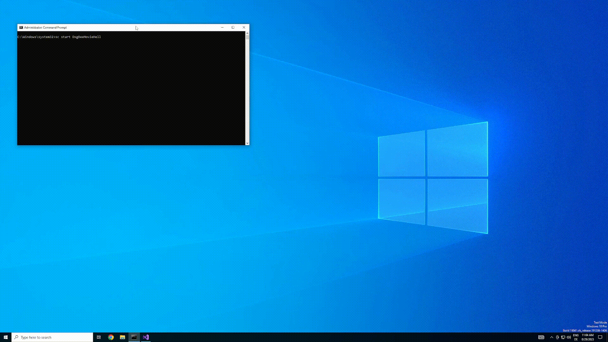

# DxgBeeMovieHell

## What is this?
A Windows kernel mode driver that whites out the screen and obliterates it with the entire beemovie script by hooking a directx function.

## Why?
This is my first Kernel Mode driver project, in which I practice using basic undocumented structs and functions in the Windows kernel. I used many resources from the game cheat development branche resulting in a kernel mode driver that uses Windwos GDI functions to manipulate the GUI.

I planned to make it look a little fancier, but GDI stuff is really annoying to deal with, so I decided to leave it as is, so that I can continue with other projects. I may, however, come back to this someday.
